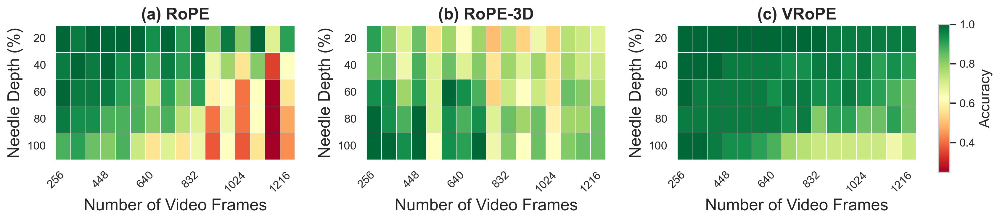

# VRoPE: Rotary Position Embedding for Video Large Language Models

Official implementation of **VRoPE: Rotary Position Embedding for Video Large Language Models**

Resources: [📑 <a href="https://arxiv.org/abs/2502.11664">Paper (Arxiv)</a>]

## News
- [2025/11/18] We have updated our official implementation of VRoPE.
- [2025/10/31] Our paper has been accepted by EMNLP 2025 (Main)! We are cleaning up the code for release and will publish it soon—stay tuned!
- [2025/5/21] We updated our paper on arxiv.
- [2025/2/18] <a href="https://arxiv.org/abs/2502.11664">Paper</a> is now available on arxiv.

## Results

- **Results on Video-NIAH**

<div align="center">
    
</div>

## Todo

- [&#10004;] Release Paper
- [&#10004;] Release Code (After the paper acceptance)

## Citation

If you find this paper helpful, you can cite the following paper:

```bibtex
@misc{liu2025vroperotarypositionembedding,
    title={VRoPE: Rotary Position Embedding for Video Large Language Models}, 
    author={Zikang Liu and Longteng Guo and Yepeng Tang and Tongtian Yue and Junxian Cai and Kai Ma and Qingbin Liu and Xi Chen and Jing Liu},
    year={2025},
    eprint={2502.11664},
    archivePrefix={arXiv},
    primaryClass={cs.AI},
    url={https://arxiv.org/abs/2502.11664}, 
}
```
