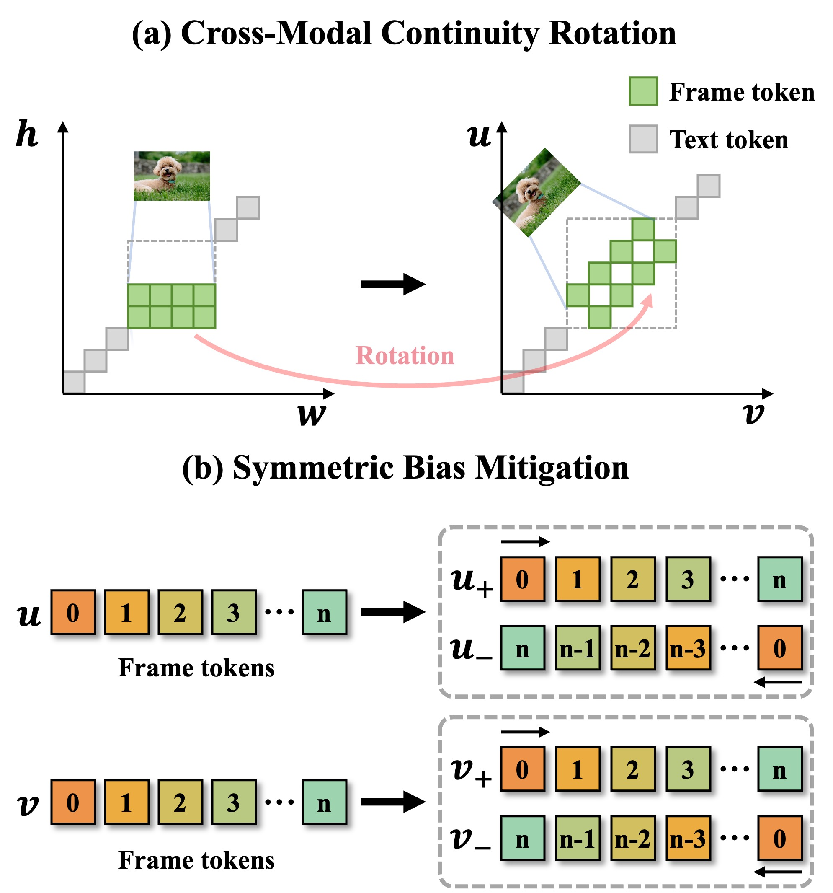

# VRoPE: Rotary Position Embedding for Video Large Language Models

Official implementation of **VRoPE: Rotary Position Embedding for Video Large Language Models**

Resources: [📑 <a href="https://arxiv.org/abs/2502.11664">Paper (Arxiv)</a>]

## News
- [2025/5/21] We updated our paper on arxiv.
- [2025/2/18] <a href="https://arxiv.org/abs/2502.11664">Paper</a> is now available on arxiv.

## Method

<div align="center">
    
</div>

- **Symmetric Bias Mitigation**: To counteract the attention bias present in RoPE-based encodings, we design a symmetric positional representation that encodes each spatial coordinate with both positive and negative components. By distributing attention more uniformly across spatial locations, this method prevents positional distortions and improves overall video understanding.
- **Temporal Centered Arrangement**: We propose a center-aligned design that spatially aligns the geometric centers of video frames with the textual arrangement axis, and arranges video frames in temporally ordered progression along the textual positional axis. This transformation not only maintains spatial coherence within video frames but also ensures a smooth transition between video and text tokens, mitigating discontinuities in the positional encoding space.

## Results

- **Results on Video-NIAH**

<div align="center">
    
</div>

## Todo

- [&#10004;] Release Paper
- [] Release Code (After the paper acceptance)
- [] Release Checkpoints (After the paper acceptance)

## Citation

If you find this paper helpful, you can cite the following paper:

```bibtex
@misc{liu2025vroperotarypositionembedding,
    title={VRoPE: Rotary Position Embedding for Video Large Language Models}, 
    author={Zikang Liu and Longteng Guo and Yepeng Tang and Tongtian Yue and Junxian Cai and Kai Ma and Qingbin Liu and Xi Chen and Jing Liu},
    year={2025},
    eprint={2502.11664},
    archivePrefix={arXiv},
    primaryClass={cs.AI},
    url={https://arxiv.org/abs/2502.11664}, 
}
```
